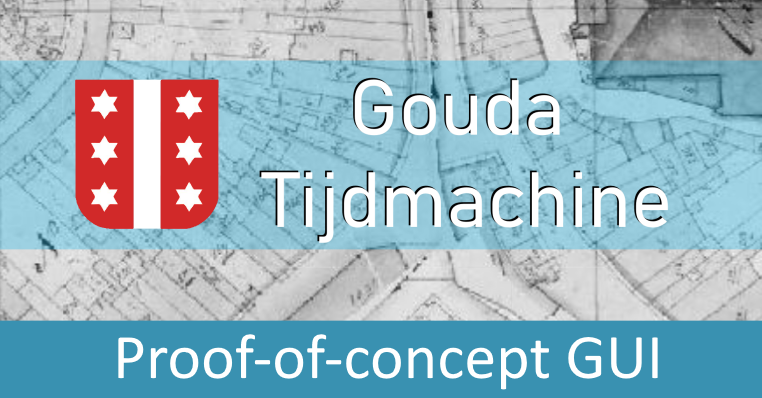

# Proof-of-concept GUI
Proof-of-concept van een GUI voor de [Gouda Tijdmachine](https://www.goudatijdmachine.nl/), gebaseerd op de brainstorms van het GTM kernteam.

# Eisen
- Responsive weergave van geo-temporele data op de kaart
- Open source - herbruikbaar voor andere tijdmachines
- Vue.js (is huidige PoC nog niet)

# Weergave van geo-temporele data op de kaart

## Tijdsgebonden informatie

Het 'Informatie in de tijd' paneel toont informatie in tijdbalk formaat die overeenkomt met het gekozen informatietype en de via de rangeslider gekozen periode. De informatie is gelieerd aan Gouda, maar heeft verder geen locatie-component. Wanneer op een item wordt gekozen wordt meer informatie getoond uit het collectiebeheersysteem. Ook de uitklaplijst met informatietypes is afhankelijk van de gekozen periode, als er geen informatie is in die periode is het informatietype niet selecteerbaar.

## Plaats- en tijdsgebonden informatie
Het 'Plekken in de tijd' toont informatietypen die aan- en uitgezet kunnen worden. Het zijn alle informatietypen die zowel een geo-component hebben als afhankelijk zijn van de gekozen periode (op dit moment het best zichtbaar met Afbeeldingen en Molens).

## Tijdsgebonden kaarten
Via het 'Kaarten in de tijd' paneel kan een kaart als ondergrond worden gekozen. Kaarten die buiten de gekozen ingestelde periode vallen zijn wel te kiezen maar qua opmaak minder prominent.

# Bronnen en componenten

## Goude Timemachine bronnen 
Bronnen beschreven op de [Gouda Tijdmachine data gebruik](https://www.goudatijdmachine.nl/data/datasets/sparql-endpoint) pagina:
- SPARQL endpoint (GraphDB)
- WMS (Geoserver)
- IIIF/Image server (Omeka S)

## Gebruikte componenten

- [n3r4zzurr0 / range-slider-input](https://github.com/n3r4zzurr0/range-slider-input)
- [Leaflet](https://leafletjs.com/)
